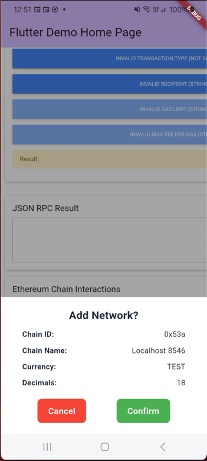
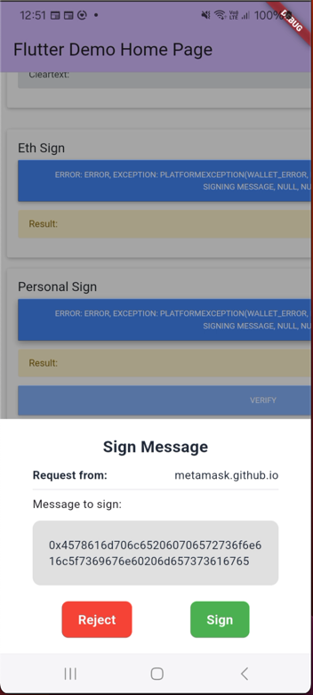
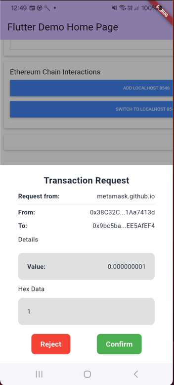

# web3_webview
The project supported send and receive messages between Dapp and in-app webview. It's a bridge between Dapp and Flutter app.
Using ethers.js [6.7.0] instead of web3.js
- Dialog for connect wallet
- Dialog for approve transaction
- Dialog for sign transaction
- Dialog for sign message
--------------------------------



--------------------------------

# Requirements
* Flutter 3.24.0 or higher

# Installation
* Add this to your package's pubspec.yaml file:
```web3_webview: ^latest```

## Usage

```dart
import 'package:web3_webview/web3_webview.dart';

/// By default config
final _defaultNetwork = NetworkConfig(
  chainId: '0x1',
  chainName: 'Ethereum Mainnet',
  nativeCurrency: NativeCurrency(
    name: 'Ethereum',
    symbol: 'ETH',
    decimals: 18,
  ),
  rpcUrls: ['https://mainnet.infura.io/v3/'],
  blockExplorerUrls: ['https://etherscan.io'],
);

Web3WebView(
  web3WalletConfig: Web3WalletConfig(
  privateKey:
    '0x...', // Your private key
    network: _defaultNetwork,
  ),
  initialUrlRequest: URLRequest(
      url: WebUri(
      'https://metamask.github.io/test-dapp/', // Replace your dapp domain
      ),
  ),
);
```

`JsonRpcMethod`: type function support.
```dart
  switch (JsonRpcMethod.fromString(method)) {
    case JsonRpcMethod.ETH_REQUEST_ACCOUNTS:
      return await _handleConnect();
    case JsonRpcMethod.ETH_ACCOUNTS:
      return _getConnectedAccounts();
    case JsonRpcMethod.ETH_BLOCK_NUMBER:
      return await _handleBlockNumber();
    case JsonRpcMethod.ETH_CHAIN_ID:
      return _state.chainId;
    case JsonRpcMethod.NET_VERSION:
      return _state.chainId;
    case JsonRpcMethod.ETH_SEND_TRANSACTION:
      return await _handleSignTransaction(params?.first);
    case JsonRpcMethod.ETH_GET_BALANCE:
      final address = params?.first;
      final balance = await _web3client.getBalance(
        EthereumAddress.fromHex(address),
      );
      return balance.getInEther.toString();
    case JsonRpcMethod.ETH_ESTIMATE_GAS:
      if (params == null || params.isEmpty) {
        throw WalletException('Missing transaction parameters');
      }
      return await _txHandler.estimateGas(params[0]);
    case JsonRpcMethod.PERSONAL_SIGN:
    case JsonRpcMethod.ETH_SIGN:
    case JsonRpcMethod.ETH_SIGN_TYPED_DATA:
    case JsonRpcMethod.ETH_SIGN_TYPED_DATA_V1:
    case JsonRpcMethod.ETH_SIGN_TYPED_DATA_V3:
    case JsonRpcMethod.ETH_SIGN_TYPED_DATA_V4:
      if (params == null || params.isEmpty) {
        throw WalletException('Missing sign parameters');
      }
      return await _handleSignMessage(method, params);
    case JsonRpcMethod.PERSONAL_EC_RECOVER:
      if (params == null || params.isEmpty) {
        throw WalletException('Missing sign parameters');
      }
      return _signingHandler.personalEcRecover(params[0], params[1]);
    case JsonRpcMethod.WALLET_SWITCH_ETHEREUM_CHAIN:
      if (params?.isNotEmpty == true) {
        final newChainId = params?.first['chainId'];
        return await _handleSwitchNetwork(newChainId);
      }
      throw WalletException('Invalid chain ID');
    case JsonRpcMethod.WALLET_ADD_ETHEREUM_CHAIN:
      if (params?.isNotEmpty == true) {
        return await _handleAddEthereumChain(params?.first);
      }
      throw WalletException('Invalid network config');
    default:
      debugPrint('Method $method not supported');
    // throw WalletException('Method $method not supported');
  }
}
```
  
# Thanks for: 
* https://github.com/PositionExchange/flutter-web3-provider
* https://docs.ethers.org/v6/